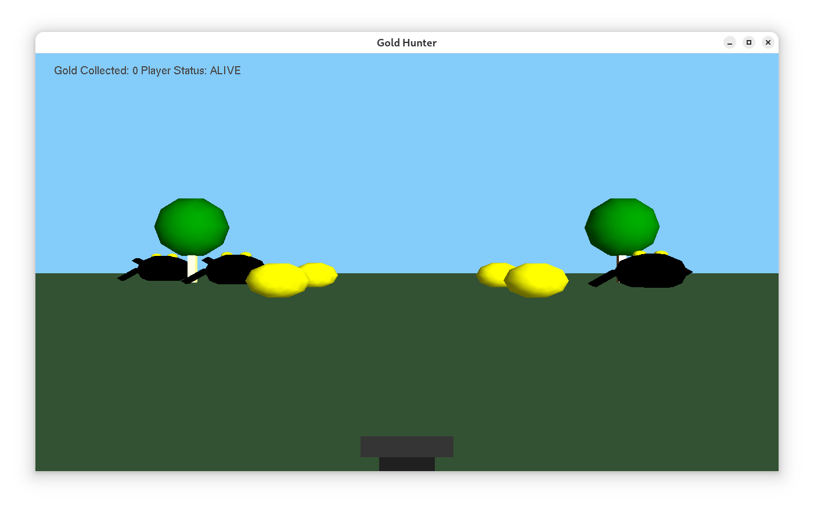

# Gold  Hunter

C++ OpenGL 3D Game demonstration with a combination of collection, survival and combat. 

This is a placeholder.

## Game Under Development

A screenshot of Gold Hunter is shown below. 




## Build From Source (Debian/Ubuntu Linux)

The source code is found in the src directory and is released with a GPL 3.0 license.

## Build from source

The instructions below show how to build and run the game from source using Debian-based distributions which have OpenGL and freeglut in their repositories. Gold Hunter is being developed and tested using Debian 13 Trixie.

You need to install the build and  C compiler packages.

```
sudo apt-get update
sudo apt install build-essential
sudo apt install pkg-config
```
Then install openGL packages needed for C++ compilation.
```
sudo apt install mesa-utils
sudo apt install mesa-common-dev
sudo apt install libglu1-mesa-dev
sudo apt install freeglut3-dev
```
The file glu.h is installed as part of freeglut3-dev. 

Use the MAKEFILE to compile the game 

```
make
```

To run game from the terminal use

```
./goldhunter
```

Make clean is also supported.

```
make clean
```

To compile manually use: 
```
g++ -std=c++17 -o goldhunter main.cpp -lGL -lGLU -lglut
```

## Version Control

[SemVer](http://semver.org/) is used for version control. The version number has the form 0.0.0 representing major, minor and bug fix changes.

The code will be updated as and when I find bugs or make improvement to the code base.

## Author

* **Alan Crispin** [Github](https://github.com/crispinprojects)


## Project Status

Active.

## Acknowledgements


